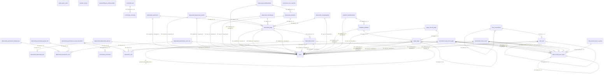

# Схема базы данных: cms

```mermaid
erDiagram
    admin_panel_users {
    }
    alembic_version {
    }
    asyncprofilesync_profileuserdata {
    }
    commands_command {
    }
    commands_run {
    }
    deprecated_attachment {
    }
    deprecated_deprecated_reaction {
    }
    deprecated_deprecated_role {
    }
    deprecated_deprecated_userrole {
    }
    deprecated_favoritepage {
    }
    deprecated_feedback {
    }
    deprecated_feedbackstatus {
    }
    deprecated_page {
    }
    deprecated_permissions_default_role {
    }
    deprecated_permissions_group_role {
    }
    deprecated_permissions_role {
    }
    deprecated_permissions_user_role {
    }
    deprecated_section {
    }
    deprecated_viewedpagelog {
    }
    feedback_feedback {
    }
    feedback_feedbackstatus {
    }
    pages_favorite_page {
    }
    pages_page {
    }
    permissions_permission {
    }
    permissions_permission_to_role_association {
    }
    permissions_role {
    }
    permissions_role_access_grant {
    }
    permissions_role_override {
    }
    permissions_role_to_user {
    }
    roles_access_user_group {
    }
    roles_access_user_to_group {
    }
    sites_serviceobject {
    }
    sites_site {
    }
    users {
    }

    commands_run ||--o{ commands_command : "FK: command_id -> id"
    deprecated_attachment ||--o{ deprecated_page : "FK: page_id -> id"
    deprecated_attachment ||--o{ users : "FK: created_by -> keycloak_id"
    deprecated_deprecated_reaction ||--o{ deprecated_page : "FK: page_id -> id"
    deprecated_deprecated_reaction ||--o{ users : "FK: created_by -> keycloak_id"
    deprecated_deprecated_reaction ||--o{ users : "FK: deleted_by -> keycloak_id"
    deprecated_deprecated_userrole ||--o{ deprecated_deprecated_role : "FK: role_id -> id"
    deprecated_deprecated_userrole ||--o{ users : "FK: user_id -> keycloak_id"
    deprecated_favoritepage ||--o{ deprecated_page : "FK: page_id -> id"
    deprecated_favoritepage ||--o{ users : "FK: user_id -> keycloak_id"
    deprecated_feedback ||--o{ deprecated_page : "FK: page_id -> id"
    deprecated_feedback ||--o{ users : "FK: user_id -> keycloak_id"
    deprecated_feedbackstatus ||--o{ deprecated_feedback : "FK: feedback_id -> id"
    deprecated_feedbackstatus ||--o{ users : "FK: created_by_id -> keycloak_id"
    deprecated_page ||--o{ deprecated_section : "FK: section_id -> id"
    deprecated_page ||--o{ users : "FK: created_by -> keycloak_id"
    deprecated_page ||--o{ users : "FK: deleted_by -> keycloak_id"
    deprecated_page ||--o{ users : "FK: updated_by -> keycloak_id"
    deprecated_permissions_default_role ||--o{ deprecated_permissions_role : "FK: role_id -> id"
    deprecated_permissions_group_role ||--o{ deprecated_permissions_role : "FK: role_id -> id"
    deprecated_permissions_user_role ||--o{ deprecated_permissions_role : "FK: role_id -> id"
    deprecated_permissions_user_role ||--o{ users : "FK: user_id -> keycloak_id"
    deprecated_section ||--o{ deprecated_section : "FK: parent_id -> id"
    deprecated_section ||--o{ deprecated_section : "FK: section_id_with_default_role -> id"
    deprecated_section ||--o{ users : "FK: created_by -> keycloak_id"
    deprecated_section ||--o{ users : "FK: deleted_by -> keycloak_id"
    deprecated_viewedpagelog ||--o{ deprecated_page : "FK: page_id -> id"
    deprecated_viewedpagelog ||--o{ users : "FK: user_id -> keycloak_id"
    feedback_feedback ||--o{ pages_page : "FK: page_id -> id"
    feedback_feedback ||--o{ users : "FK: created_by_id -> keycloak_id"
    feedback_feedbackstatus ||--o{ feedback_feedback : "FK: feedback_id -> id"
    feedback_feedbackstatus ||--o{ users : "FK: created_by_id -> keycloak_id"
    pages_favorite_page ||--o{ pages_page : "FK: page_id -> id"
    pages_favorite_page ||--o{ users : "FK: user_id -> keycloak_id"
    pages_page ||--o{ pages_page : "FK: parent_id -> id"
    pages_page ||--o{ users : "FK: created_by_id -> keycloak_id"
    pages_page ||--o{ users : "FK: updated_by_id -> keycloak_id"
    permissions_permission_to_role_association ||--o{ permissions_permission : "FK: permission_id -> id"
    permissions_permission_to_role_association ||--o{ permissions_role : "FK: role_id -> id"
    permissions_role_access_grant ||--o{ permissions_role : "FK: role_id -> id"
    permissions_role_access_grant ||--o{ roles_access_user_group : "FK: group_id -> id"
    permissions_role_access_grant ||--o{ roles_access_user_group : "FK: group_id -> id"
    permissions_role_access_grant ||--o{ roles_access_user_group : "FK: group_id -> id"
    permissions_role_access_grant ||--o{ roles_access_user_group : "FK: group_id -> id"
    permissions_role_access_grant ||--o{ users : "FK: user_id -> keycloak_id"
    permissions_role_to_user ||--o{ permissions_role : "FK: role_id -> id"
    permissions_role_to_user ||--o{ roles_access_user_group : "FK: group_id -> id"
    permissions_role_to_user ||--o{ roles_access_user_group : "FK: group_id -> id"
    permissions_role_to_user ||--o{ roles_access_user_group : "FK: group_id -> id"
    permissions_role_to_user ||--o{ roles_access_user_group : "FK: group_id -> id"
    permissions_role_to_user ||--o{ users : "FK: user_id -> keycloak_id"
    roles_access_user_group ||--o{ roles_access_user_group : "FK: parent_id -> id"
    roles_access_user_to_group ||--o{ roles_access_user_group : "FK: user_group_id -> id"
    sites_serviceobject ||--o{ sites_serviceobject : "FK: parent_id -> id"
    sites_serviceobject ||--o{ sites_site : "FK: site_id -> id"
    sites_site ||--o{ sites_site : "FK: parent_id -> id"
    sites_site ||--o{ users : "FK: created_by_id -> keycloak_id"
    sites_site ||--o{ users : "FK: updated_by_id -> keycloak_id"
```
