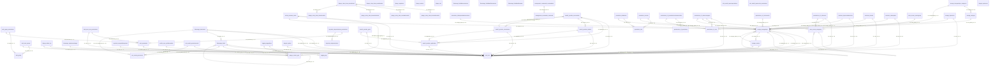

# Схема базы данных: filestorage

```mermaid
erDiagram
    activity_streams_action {
    }
    auth_group {
    }
    auth_group_permissions {
    }
    auth_permission {
    }
    auth_user {
    }
    auth_user_groups {
    }
    auth_user_user_permissions {
    }
    django_admin_log {
    }
    django_celery_beat_clockedschedule {
    }
    django_celery_beat_crontabschedule {
    }
    django_celery_beat_intervalschedule {
    }
    django_celery_beat_periodictask {
    }
    django_celery_beat_periodictasks {
    }
    django_celery_beat_solarschedule {
    }
    django_content_type {
    }
    django_migrations {
    }
    django_session {
    }
    django_site {
    }
    extensions_folderpermittedextensions {
    }
    filestorage_attachment {
    }
    filestorage_attachmentimage {
    }
    filestorage_folder {
    }
    filestorage_forbiddenextension {
    }
    filestorage_forbiddenfilecharacter {
    }
    filestorage_forbiddenfilename {
    }
    keycloak_rolepermissions {
    }
    keycloak_rolepermissions_permissions {
    }
    keycloak_userprofilekeycloak {
    }
    management_commands_command {
    }
    management_commands_commandrun {
    }
    oauth2_provider_accesstoken {
    }
    oauth2_provider_application {
    }
    oauth2_provider_grant {
    }
    oauth2_provider_idtoken {
    }
    oauth2_provider_refreshtoken {
    }
    permission_defaultrole {
    }
    permission_role {
    }
    permission_userrole {
    }
    permissions_v2_permission {
    }
    permissions_v2_permissiontoroleassociation {
    }
    permissions_v2_role {
    }
    permissions_v2_roleaccessgrant {
    }
    permissions_v2_roleoverride {
    }
    permissions_v2_roletouser {
    }
    profile_sync_profileuserdata {
    }
    reactions_deprecatedreaction {
    }
    reactions_favorite {
    }
    reactions_subscription {
    }
    role_model_genericpermission {
    }
    role_model_genericrole {
    }
    role_model_genericrole_permissions {
    }
    role_model_genericuserrole {
    }
    roles_access_usergroup {
    }
    roles_access_usertogroup {
    }
    storage_category {
    }
    storage_objectview {
    }
    storage_storageobject {
    }
    storage_storageobject_categories {
    }
    storage_version {
    }
    tagging_tag {
    }
    tagging_taggeditem {
    }
    tastypie_apiaccess {
    }
    tastypie_apikey {
    }

    activity_streams_action ||--o{ auth_user : "FK: actor_id -> id"
    activity_streams_action ||--o{ django_content_type : "FK: object_content_type_id -> id"
    activity_streams_action ||--o{ storage_storageobject : "FK: target_id -> id"
    auth_group_permissions ||--o{ auth_group : "FK: group_id -> id"
    auth_group_permissions ||--o{ auth_permission : "FK: permission_id -> id"
    auth_permission ||--o{ django_content_type : "FK: content_type_id -> id"
    auth_user_groups ||--o{ auth_group : "FK: group_id -> id"
    auth_user_groups ||--o{ auth_user : "FK: user_id -> id"
    auth_user_user_permissions ||--o{ auth_permission : "FK: permission_id -> id"
    auth_user_user_permissions ||--o{ auth_user : "FK: user_id -> id"
    django_admin_log ||--o{ auth_user : "FK: user_id -> id"
    django_admin_log ||--o{ django_content_type : "FK: content_type_id -> id"
    django_celery_beat_periodictask ||--o{ django_celery_beat_clockedschedule : "FK: clocked_id -> id"
    django_celery_beat_periodictask ||--o{ django_celery_beat_crontabschedule : "FK: crontab_id -> id"
    django_celery_beat_periodictask ||--o{ django_celery_beat_intervalschedule : "FK: interval_id -> id"
    django_celery_beat_periodictask ||--o{ django_celery_beat_solarschedule : "FK: solar_id -> id"
    extensions_folderpermittedextensions ||--o{ storage_storageobject : "FK: storage_object_id -> id"
    filestorage_attachment ||--o{ auth_user : "FK: created_by_id -> id"
    filestorage_attachment ||--o{ auth_user : "FK: updated_by_id -> id"
    filestorage_attachment ||--o{ filestorage_folder : "FK: folder_id -> id"
    filestorage_attachment ||--o{ role_model_genericrole : "FK: user_default_role_id -> id"
    filestorage_attachmentimage ||--o{ auth_user : "FK: created_by_id -> id"
    filestorage_folder ||--o{ auth_user : "FK: created_by_id -> id"
    filestorage_folder ||--o{ auth_user : "FK: updated_by_id -> id"
    filestorage_folder ||--o{ filestorage_folder : "FK: parent_id -> id"
    filestorage_folder ||--o{ role_model_genericrole : "FK: user_default_role_id -> id"
    keycloak_rolepermissions_permissions ||--o{ auth_permission : "FK: permission_id -> id"
    keycloak_rolepermissions_permissions ||--o{ keycloak_rolepermissions : "FK: rolepermissions_id -> id"
    keycloak_userprofilekeycloak ||--o{ auth_user : "FK: user_id -> id"
    management_commands_commandrun ||--o{ management_commands_command : "FK: command_id -> id"
    oauth2_provider_accesstoken ||--o{ auth_user : "FK: user_id -> id"
    oauth2_provider_accesstoken ||--o{ oauth2_provider_application : "FK: application_id -> id"
    oauth2_provider_accesstoken ||--o{ oauth2_provider_idtoken : "FK: id_token_id -> id"
    oauth2_provider_accesstoken ||--o{ oauth2_provider_refreshtoken : "FK: source_refresh_token_id -> id"
    oauth2_provider_application ||--o{ auth_user : "FK: user_id -> id"
    oauth2_provider_grant ||--o{ auth_user : "FK: user_id -> id"
    oauth2_provider_grant ||--o{ oauth2_provider_application : "FK: application_id -> id"
    oauth2_provider_idtoken ||--o{ auth_user : "FK: user_id -> id"
    oauth2_provider_idtoken ||--o{ oauth2_provider_application : "FK: application_id -> id"
    oauth2_provider_refreshtoken ||--o{ auth_user : "FK: user_id -> id"
    oauth2_provider_refreshtoken ||--o{ oauth2_provider_accesstoken : "FK: access_token_id -> id"
    oauth2_provider_refreshtoken ||--o{ oauth2_provider_application : "FK: application_id -> id"
    permission_defaultrole ||--o{ permission_role : "FK: role_id -> id"
    permission_defaultrole ||--o{ storage_storageobject : "FK: storage_object_id -> id"
    permission_userrole ||--o{ permission_role : "FK: role_id -> id"
    permission_userrole ||--o{ storage_storageobject : "FK: storage_object_id -> id"
    permissions_v2_permissiontoroleassociation ||--o{ permissions_v2_permission : "FK: permission_id -> id"
    permissions_v2_permissiontoroleassociation ||--o{ permissions_v2_role : "FK: role_id -> id"
    permissions_v2_roleaccessgrant ||--o{ auth_user : "FK: user_id -> id"
    permissions_v2_roleaccessgrant ||--o{ permissions_v2_role : "FK: role_id -> id"
    permissions_v2_roleaccessgrant ||--o{ roles_access_usergroup : "FK: group_id -> id"
    permissions_v2_roleaccessgrant ||--o{ storage_storageobject : "FK: storage_object_id -> id"
    permissions_v2_roleoverride ||--o{ storage_storageobject : "FK: storage_object_id -> id"
    permissions_v2_roletouser ||--o{ auth_user : "FK: user_id -> id"
    permissions_v2_roletouser ||--o{ permissions_v2_role : "FK: role_id -> id"
    permissions_v2_roletouser ||--o{ roles_access_usergroup : "FK: group_id -> id"
    profile_sync_profileuserdata ||--o{ auth_user : "FK: user_id -> id"
    reactions_deprecatedreaction ||--o{ auth_user : "FK: user_id -> id"
    reactions_deprecatedreaction ||--o{ storage_storageobject : "FK: storage_object_id -> id"
    reactions_favorite ||--o{ auth_user : "FK: user_id -> id"
    reactions_favorite ||--o{ storage_storageobject : "FK: storage_object_id -> id"
    reactions_subscription ||--o{ auth_user : "FK: user_id -> id"
    reactions_subscription ||--o{ storage_storageobject : "FK: storage_object_id -> id"
    role_model_genericuserrole ||--o{ django_content_type : "FK: content_type_id -> id"
    role_model_genericuserrole ||--o{ role_model_genericrole : "FK: role_id -> id"
    roles_access_usergroup ||--o{ roles_access_usergroup : "FK: parent_id -> id"
    roles_access_usertogroup ||--o{ roles_access_usergroup : "FK: user_group_id -> id"
    storage_category ||--o{ storage_storageobject : "FK: root_folder_id -> id"
    storage_objectview ||--o{ auth_user : "FK: user_id -> id"
    storage_objectview ||--o{ storage_storageobject : "FK: storage_object_id -> id"
    storage_storageobject ||--o{ auth_user : "FK: created_by_id -> id"
    storage_storageobject ||--o{ auth_user : "FK: deleted_by_id -> id"
    storage_storageobject ||--o{ auth_user : "FK: updated_by_id -> id"
    storage_storageobject ||--o{ storage_storageobject : "FK: context_folder_id -> id"
    storage_storageobject ||--o{ storage_storageobject : "FK: object_with_extensions_id -> id"
    storage_storageobject ||--o{ storage_storageobject : "FK: object_with_role_id -> id"
    storage_storageobject ||--o{ storage_storageobject : "FK: parent_id -> id"
    storage_storageobject ||--o{ storage_version : "FK: version_id -> id"
    storage_storageobject_categories ||--o{ storage_category : "FK: category_id -> id"
    storage_storageobject_categories ||--o{ storage_storageobject : "FK: storageobject_id -> id"
    storage_version ||--o{ auth_user : "FK: created_by_id -> id"
    storage_version ||--o{ auth_user : "FK: deleted_by_id -> id"
    storage_version ||--o{ storage_storageobject : "FK: storage_object_id -> id"
    tagging_taggeditem ||--o{ django_content_type : "FK: content_type_id -> id"
    tagging_taggeditem ||--o{ tagging_tag : "FK: tag_id -> id"
    tastypie_apikey ||--o{ auth_user : "FK: user_id -> id"
```
