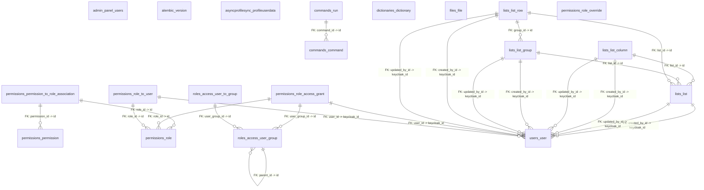

# Схема базы данных: lists

```mermaid
erDiagram
    admin_panel_users {
    }
    alembic_version {
    }
    asyncprofilesync_profileuserdata {
    }
    commands_command {
    }
    commands_run {
    }
    dictionaries_dictionary {
    }
    files_file {
    }
    lists_list {
    }
    lists_list_column {
    }
    lists_list_group {
    }
    lists_list_row {
    }
    permissions_permission {
    }
    permissions_permission_to_role_association {
    }
    permissions_role {
    }
    permissions_role_access_grant {
    }
    permissions_role_override {
    }
    permissions_role_to_user {
    }
    roles_access_user_group {
    }
    roles_access_user_to_group {
    }
    users_user {
    }

    commands_run ||--o{ commands_command : "FK: command_id -> id"
    lists_list ||--o{ users_user : "FK: created_by_id -> keycloak_id"
    lists_list ||--o{ users_user : "FK: updated_by_id -> keycloak_id"
    lists_list_column ||--o{ lists_list : "FK: list_id -> id"
    lists_list_column ||--o{ users_user : "FK: created_by_id -> keycloak_id"
    lists_list_column ||--o{ users_user : "FK: updated_by_id -> keycloak_id"
    lists_list_group ||--o{ lists_list : "FK: list_id -> id"
    lists_list_group ||--o{ users_user : "FK: created_by_id -> keycloak_id"
    lists_list_group ||--o{ users_user : "FK: updated_by_id -> keycloak_id"
    lists_list_row ||--o{ lists_list : "FK: list_id -> id"
    lists_list_row ||--o{ lists_list_group : "FK: group_id -> id"
    lists_list_row ||--o{ users_user : "FK: created_by_id -> keycloak_id"
    lists_list_row ||--o{ users_user : "FK: updated_by_id -> keycloak_id"
    permissions_permission_to_role_association ||--o{ permissions_permission : "FK: permission_id -> id"
    permissions_permission_to_role_association ||--o{ permissions_role : "FK: role_id -> id"
    permissions_role_access_grant ||--o{ permissions_role : "FK: role_id -> id"
    permissions_role_access_grant ||--o{ roles_access_user_group : "FK: user_group_id -> id"
    permissions_role_access_grant ||--o{ users_user : "FK: user_id -> keycloak_id"
    permissions_role_to_user ||--o{ permissions_role : "FK: role_id -> id"
    permissions_role_to_user ||--o{ users_user : "FK: user_id -> keycloak_id"
    roles_access_user_group ||--o{ roles_access_user_group : "FK: parent_id -> id"
    roles_access_user_to_group ||--o{ roles_access_user_group : "FK: user_group_id -> id"
```
